# RemedialDev5 Surveillance

A neighborhood surveillance web application that allows residents to report observations, moderators to review them, and administrators to manage users and audit every security-relevant action. The application provides a map-based overview of public observations with filtering, clustering, and heatmap visualization.

## Features

- **User accounts** — registration, login, and password management with scrypt-based password hashing
- **Observations** — create, view, edit, and delete observations with automatic geocoding of addresses
- **Modification requests** — request an edit or deletion of an observation; moderators approve or reject requests
- **Map intelligence** — Leaflet map with markers, clustering, heatmap mode, category/date filters, sidebar, and location search
- **Profile management** — edit profile, change password, set map preferences (preferred city and location), delete account
- **Administration** — dashboard, user management, role and status management, observation moderation, and a scoped audit log
- **Role-based access control** — four roles (`USER`, `MODERATOR`, `ADMIN`, `OWNER`) with enforced authorization at the API level

## Technology Stack

| Layer | Technology |
|-------|------------|
| Frontend | Vanilla JavaScript, HTML5, CSS3, Leaflet (with markercluster and heat plugins) |
| Backend | Node.js, Express 5 |
| Database | PostgreSQL 16 |
| Authentication | JSON Web Tokens (`jsonwebtoken`) |
| Password hashing | Node.js `crypto` (scrypt) |
| Containerization | Docker, Docker Compose |

## Installation

### Prerequisites

- Node.js 20 or later
- PostgreSQL 16 (or Docker)
- npm

### Quick Start

Install dependencies, configure the environment, and start the application:

```
npm install
cp .env.example .env
docker compose up --build
```

This builds and starts the Node.js server together with the PostgreSQL database. The application is then available at:

```
http://localhost/
```

Verify the server and database are healthy at `http://localhost/health`.

### Environment Variables

The `.env` file configures the database connection and the JWT signing secret. Copy the example file and adjust the values as needed:

| Variable | Description | Default |
|----------|-------------|---------|
| `POSTGRES_USER` | PostgreSQL user | `postgres` |
| `POSTGRES_PASSWORD` | PostgreSQL password | `changeme` |
| `POSTGRES_DB` | Database name | `surveillance` |
| `PGHOST` | Database host | `db` (Docker) / `localhost` (local) |
| `PGPORT` | Database port | `5432` |
| `PGUSER` | Pool user (falls back to `POSTGRES_USER`) | — |
| `PGPASSWORD` | Pool password (falls back to `POSTGRES_PASSWORD`) | — |
| `PGDATABASE` | Pool database (falls back to `POSTGRES_DB`) | — |
| `JWT_SECRET` | Secret used to sign JSON Web Tokens | `change-this-to-a-random-secret` |

> Change `JWT_SECRET` to a random, unguessable value before deployment.

## Running Locally (without Docker)

Install dependencies and start the Node.js server directly. This requires a running PostgreSQL instance:

```
npm install
node index.js
```

The server listens on port `80` by default (`PORT` to override). On startup it connects to the database, creates the schema (tables, roles, indexes), and seeds the initial data. The schema is initialized automatically — no manual migration step is required.

## Docker Setup

The `compose.yaml` file starts the Node.js server and a PostgreSQL 16 database together:

```
docker compose up --build
```

- The server is exposed on port `80`.
- The database is exposed only within the Docker network and is volume-backed (`db-data`) so data persists across restarts.
- A health check on the database (`pg_isready`) ensures the server waits for PostgreSQL to be ready.

## Database Setup

The schema is created automatically at startup by `src/database/init.js` and consists of five tables:

- `roles` — role definitions (`USER`, `MODERATOR`, `ADMIN`, `OWNER`)
- `users` — user accounts with scrypt-hashed passwords and soft-delete support
- `observations` — observations with coordinates, visibility, and status
- `observation_requests` — edit/delete modification requests with proposed field values
- `audit_log` — security-relevant actions for accountability

The initializer also seeds a default `OWNER` account (`owner@surveillance.local`) on first run. Database access uses PostgreSQL's `pg` pool and parameterized queries throughout.

## Application Screenshots

### Landing Page
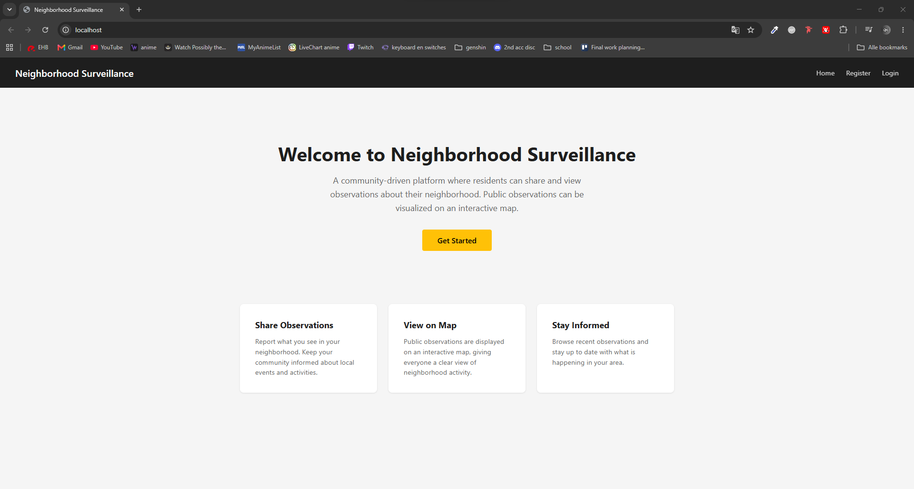

### Login & Register
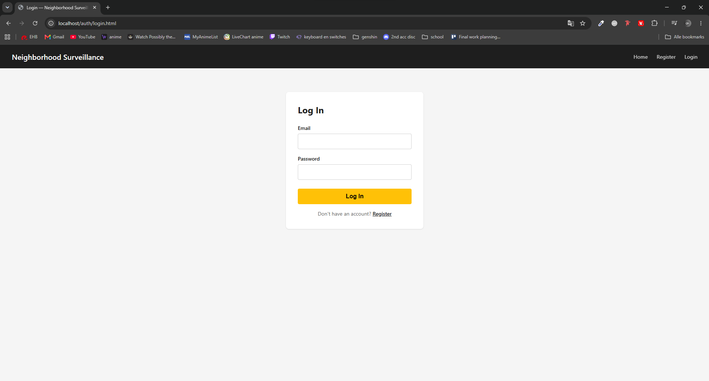
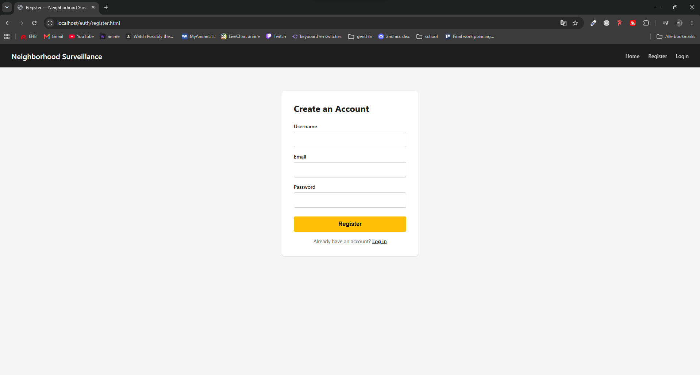

### Map Page
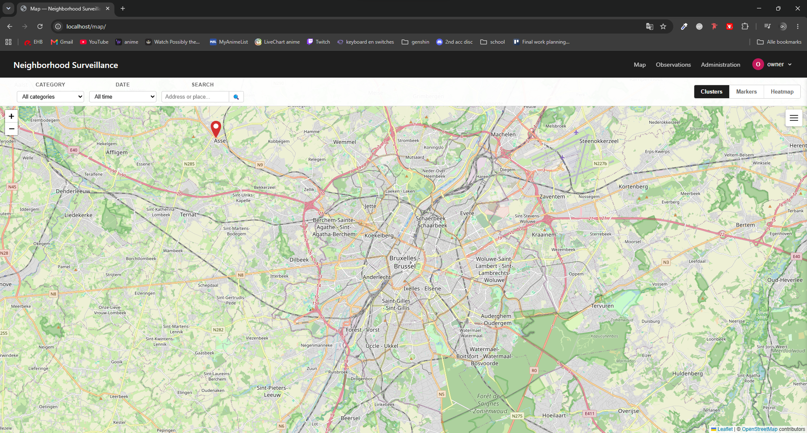

### Observations Page
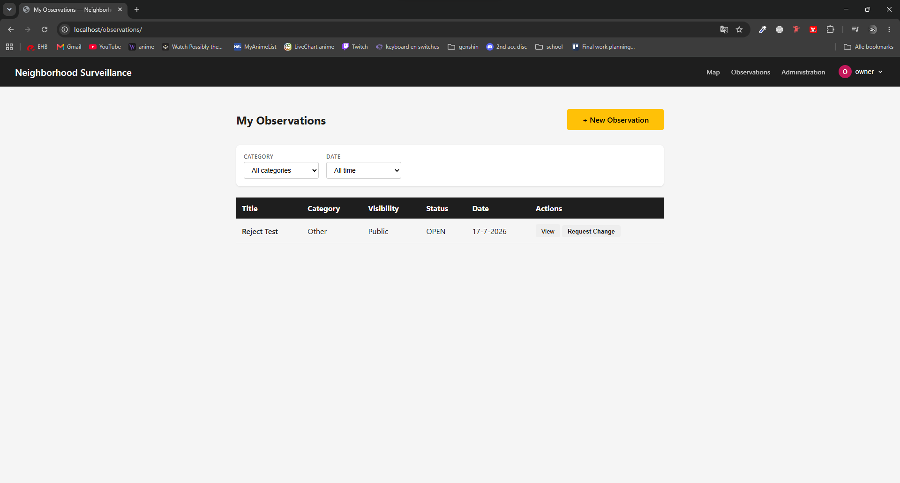
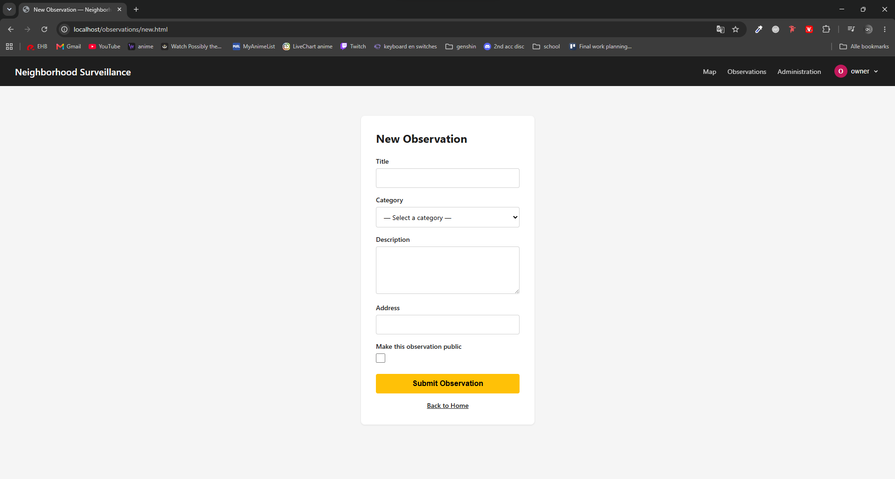

### Admin Dashboard
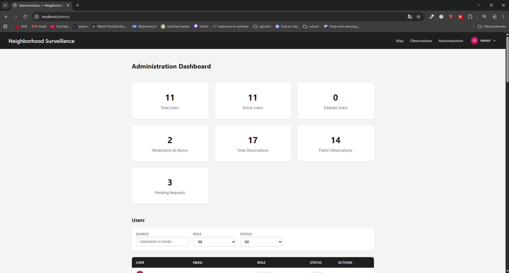
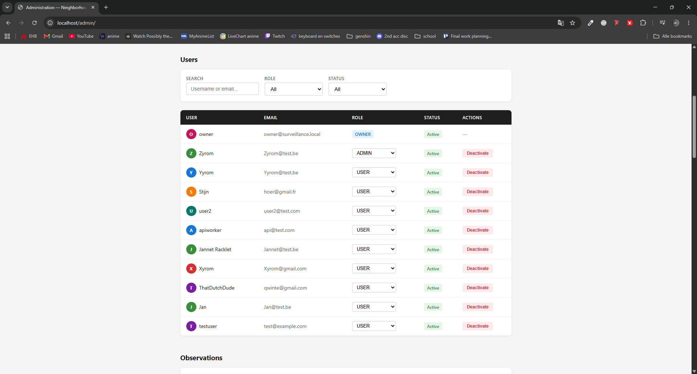
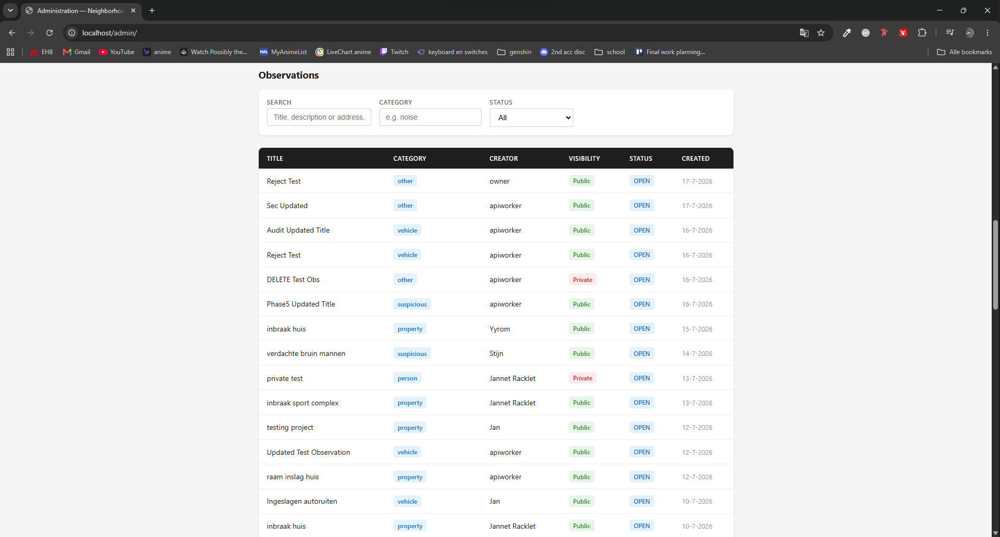
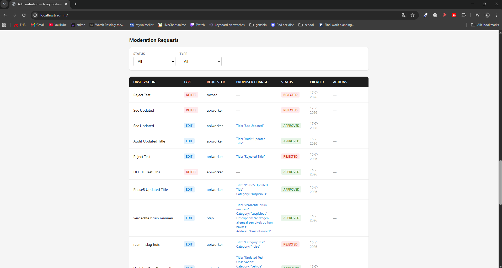
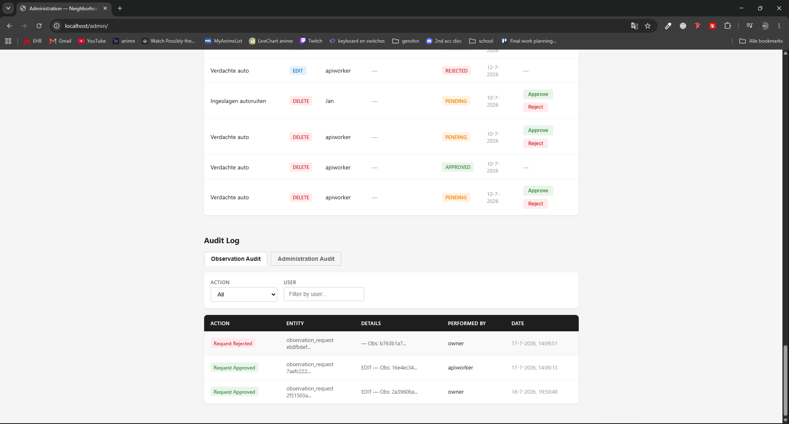

### Profile Page
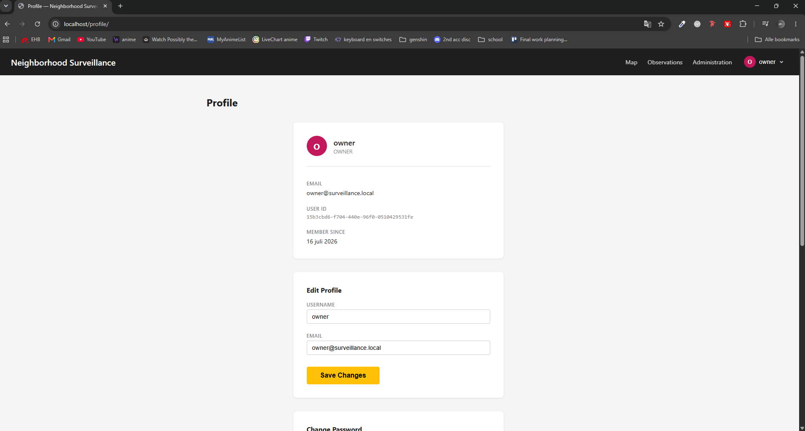
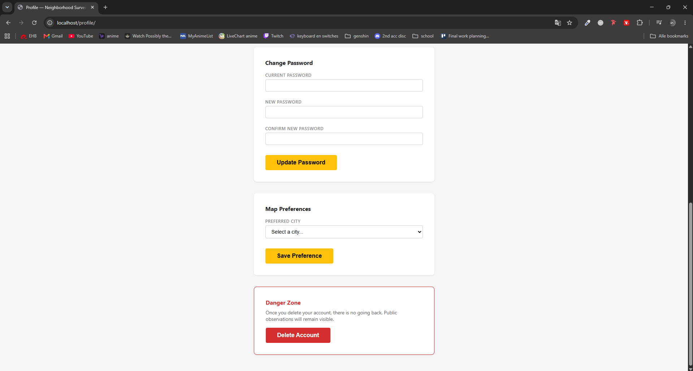

## Folder Structure

```
.
├── index.js                 # Application entry point — Express setup, routes, startup
├── compose.yaml             # Docker Compose configuration
├── Dockerfile               # Container image definition
├── .env.example             # Example environment configuration
├── public/                  # Frontend (static files served by Express)
│   ├── index.html           # Home page
│   ├── auth/                # Login and registration pages
│   ├── admin/               # Administration dashboard
│   ├── map/                 # Map page
│   ├── observations/        # Observation list, detail, edit, and create pages
│   ├── profile/             # Profile page
│   ├── css/                 # Global stylesheets
│   └── js/                  # Page scripts and shared helpers
└── src/
    ├── controllers/         # Business logic (auth, users, observations, requests, profile, admin, audit)
    ├── middleware/          # authenticate and authorize middleware
    ├── routes/              # Express route definitions
    ├── services/            # External services (geocoding)
    ├── database/            # Schema initialization and seed data
    └── db.js                # PostgreSQL connection pool (singleton)
```

## API Overview

All API routes return JSON. Protected routes require an `Authorization: Bearer <token>` header; role-restricted routes require the role shown.

| Method | Endpoint | Auth | Description |
|--------|----------|------|-------------|
| POST | `/api/auth/register` | — | Register a new user |
| POST | `/api/auth/login` | — | Log in and receive a JWT |
| GET | `/api/observations/public` | JWT | Public observations for the map |
| GET | `/api/observations` | JWT | Current user's observations |
| GET/POST | `/api/observations/:id` | JWT | Get / create observations |
| PUT/DELETE | `/api/observations/:id` | JWT | Edit / delete own observation |
| GET/POST | `/api/observations/:id/requests` | JWT | List / create modification requests |
| GET/PUT/DELETE | `/api/profile` | JWT | Profile management |
| PUT | `/api/profile/password` | JWT | Change password |
| GET/PUT | `/api/profile/preferences` | JWT | Map preferences |
| GET | `/api/admin/dashboard` | `MODERATOR` | Admin dashboard counts |
| GET | `/api/admin/users` | `MODERATOR` | User list with filters |
| PUT | `/api/admin/users/:id/role` | `ADMIN` | Change a user's role |
| PUT | `/api/admin/users/:id/status` | `ADMIN` | Activate / deactivate a user |
| GET | `/api/admin/observations` | `MODERATOR` | All observations with filters |
| GET | `/api/admin/requests` | `MODERATOR` | Modification requests |
| PUT | `/api/admin/requests/:id/approve` | `MODERATOR` | Approve a request |
| PUT | `/api/admin/requests/:id/reject` | `MODERATOR` | Reject a request |
| GET | `/api/admin/audit` | `MODERATOR`+ | Audit log (scope-based) |
| GET | `/health` | — | Server and database health |

## Documentation Overview

The full project documentation is available in the `docs/` directory:

| Document | Description |
|----------|-------------|
| [Introduction](docs/Introduction.md) | Purpose, target users, and goals |
| [Project Analysis](docs/Project_Analysis.md) | Functional and non-functional requirements |
| [System Architecture](docs/System_Architecture.md) | MVC structure, data flow, auth flow |
| [Database Design](docs/Database_Design.md) | Schema, relationships, indexes |
| [Backend Architecture](docs/Backend_Architecture.md) | Controllers, routes, middleware, REST API |
| [Frontend Architecture](docs/Frontend_Architecture.md) | Pages, components, Leaflet integration |
| [Development Process](docs/Development_Process.md) | Workflow, timeline, challenges |
| [AI-Assisted Development](docs/AI_Assisted_Development.md) | Role of AI in the development process |
| [Testing](docs/Testing.md) | Testing strategy and scenarios |
| [Security](docs/Security.md) | Security measures and rationale |
| [Future Improvements](docs/Future_Improvements.md) | Planned extensions |
| [References](docs/References.md) | Sources (IEEE style) |

## Future Work

Notifications, real-time map updates, a mobile application, image uploads, machine-learning analysis, statistics, and production deployment are planned extensions. See [Future Improvements](docs/Future_Improvements.md) for details and rationale.

## License

ISC
